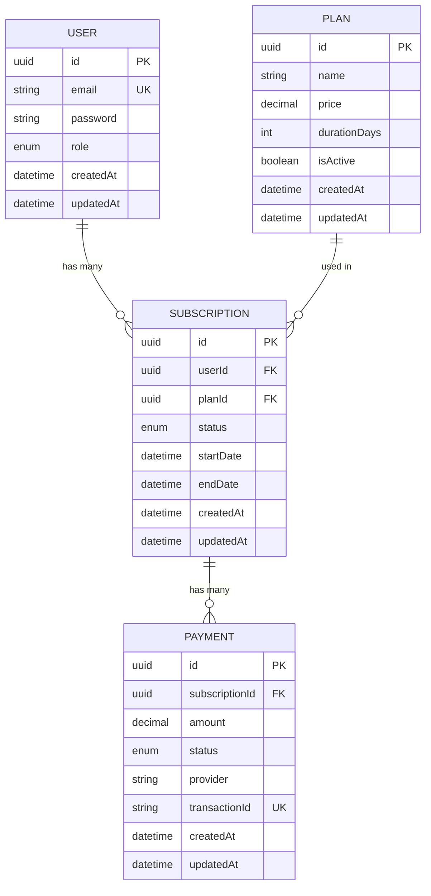

# Database Design - Subscription Management SaaS

**Project:** Subscription Management System  
**Database:** PostgreSQL  
**ORM:** Prisma  
**Version:** 1.0  
**Date:** January 9, 2026

---

## 1. Entity Relationship Diagram (ERD)



---

## 2. Table Specifications

### 2.1 User Table

**Purpose:** Store user account information

| Column | Type | Constraints | Description |
|--------|------|-------------|-------------|
| id | UUID | PRIMARY KEY | Unique user identifier |
| email | VARCHAR(255) | UNIQUE, NOT NULL | User email address |
| password | VARCHAR(255) | NOT NULL | Hashed password (bcrypt) |
| role | ENUM | NOT NULL, DEFAULT 'USER' | User role (USER, ADMIN) |
| createdAt | TIMESTAMP | NOT NULL, DEFAULT NOW() | Account creation timestamp |
| updatedAt | TIMESTAMP | NOT NULL | Last update timestamp |

**Indexes:**
- PRIMARY KEY on `id`
- UNIQUE INDEX on `email`
- INDEX on `createdAt` (for analytics)1 

**Business Rules:**
- Email must be valid format (validated at application layer)
- Password must be hashed before storage (bcrypt, 10 rounds)
- Default role is USER
- Email is case-insensitive (normalized to lowercase)

---

### 2.2 Plan Table

**Purpose:** Store subscription plan configurations

| Column | Type | Constraints | Description |
|--------|------|-------------|-------------|
| id | UUID | PRIMARY KEY | Unique plan identifier |
| name | VARCHAR(100) | NOT NULL | Plan name (e.g., "Premium Monthly") |
| price | DECIMAL(10,2) | NOT NULL | Plan price in USD |
| durationDays | INTEGER | NOT NULL | Subscription duration in days |
| isActive | BOOLEAN | NOT NULL, DEFAULT true | Plan availability status |
| createdAt | TIMESTAMP | NOT NULL, DEFAULT NOW() | Plan creation timestamp |
| updatedAt | TIMESTAMP | NOT NULL | Last update timestamp |

**Indexes:**
- PRIMARY KEY on `id`
- INDEX on `isActive` (for filtering active plans)
- INDEX on `price` (for sorting/filtering)

**Business Rules:**
- Price must be > 0
- durationDays must be > 0
- Only active plans can be subscribed to
- Deleting plans is soft-delete (set isActive = false)

**Sample Data:**
```sql
INSERT INTO Plan (id, name, price, durationDays) VALUES
  ('uuid1', 'Basic Monthly', 9.99, 30),
  ('uuid2', 'Premium Monthly', 14.99, 30),
  ('uuid3', 'Premium Annual', 149.99, 365);
```

---

### 2.3 Subscription Table

**Purpose:** Store user subscription records

| Column | Type | Constraints | Description |
|--------|------|-------------|-------------|
| id | UUID | PRIMARY KEY | Unique subscription identifier |
| userId | UUID | FOREIGN KEY, NOT NULL | Reference to User |
| planId | UUID | FOREIGN KEY, NOT NULL | Reference to Plan |
| status | ENUM | NOT NULL, DEFAULT 'PENDING' | Subscription status |
| startDate | TIMESTAMP | NULL | Subscription start date (set on activation) |
| endDate | TIMESTAMP | NULL | Subscription end date (calculated) |
| createdAt | TIMESTAMP | NOT NULL, DEFAULT NOW() | Subscription creation timestamp |
| updatedAt | TIMESTAMP | NOT NULL | Last update timestamp |

**Status Enum Values:**
- `PENDING` - Payment not yet confirmed
- `ACTIVE` - Payment confirmed, subscription active
- `CANCELED` - User canceled subscription
- `FAILED` - Payment failed

**Indexes:**
- PRIMARY KEY on `id`
- FOREIGN KEY on `userId` → User(id) ON DELETE CASCADE
- FOREIGN KEY on `planId` → Plan(id) ON DELETE RESTRICT
- INDEX on `userId, status` (for finding user's active subscription)
- INDEX on `status` (for admin queries)
- INDEX on `endDate` (for expiration checks)

**Business Rules:**
- A user can have only ONE subscription with status = ACTIVE
- startDate is NULL until payment confirms (status → ACTIVE)
- endDate = startDate + Plan.durationDays (calculated on activation)
- Status transitions:
  - PENDING → ACTIVE (payment success)
  - PENDING → FAILED (payment failed)
  - ACTIVE → CANCELED (user cancels)
- CANCELED and FAILED are terminal states (no further transitions)

**Constraints:**
```sql
-- Ensure only one active subscription per user
CREATE UNIQUE INDEX unique_active_subscription 
ON Subscription(userId) 
WHERE status = 'ACTIVE';
```

---

### 2.4 Payment Table

**Purpose:** Store payment transaction records

| Column | Type | Constraints | Description |
|--------|------|-------------|-------------|
| id | UUID | PRIMARY KEY | Unique payment identifier |
| subscriptionId | UUID | FOREIGN KEY, NOT NULL | Reference to Subscription |
| amount | DECIMAL(10,2) | NOT NULL | Payment amount |
| status | ENUM | NOT NULL, DEFAULT 'PENDING' | Payment status |
| provider | VARCHAR(50) | NOT NULL | Payment provider name |
| transactionId | VARCHAR(255) | UNIQUE, NULL | External transaction ID |
| createdAt | TIMESTAMP | NOT NULL, DEFAULT NOW() | Payment creation timestamp |
| updatedAt | TIMESTAMP | NOT NULL | Last update timestamp |

**Status Enum Values:**
- `PENDING` - Payment initiated
- `COMPLETED` - Payment successful
- `FAILED` - Payment failed

**Indexes:**
- PRIMARY KEY on `id`
- FOREIGN KEY on `subscriptionId` → Subscription(id) ON DELETE CASCADE
- UNIQUE INDEX on `transactionId` (for idempotency)
- INDEX on `subscriptionId` (for payment history)
- INDEX on `status` (for analytics)

**Business Rules:**
- Amount must match Subscription.Plan.price (validated at application layer)
- transactionId is unique (prevents duplicate processing)
- Payment records are immutable (audit trail)
- Only PENDING payments can transition to COMPLETED/FAILED

---

## 3. Relationships

### 3.1 User → Subscription (One-to-Many)
- A user can have multiple subscriptions (historical data)
- A user can have only ONE active subscription
- Cascade delete: If user deleted, all subscriptions deleted

### 3.2 Plan → Subscription (One-to-Many)
- A plan can be used in multiple subscriptions
- Restrict delete: Cannot delete plan if active subscriptions exist
- Soft delete plans instead (set isActive = false)

### 3.3 Subscription → Payment (One-to-Many)
- A subscription can have multiple payment attempts
- Typically one successful payment per subscription
- Cascade delete: If subscription deleted, all payments deleted

---

## 4. Data Integrity Rules

### 4.1 Referential Integrity
- All foreign keys enforced at database level
- ON DELETE CASCADE for user → subscription
- ON DELETE RESTRICT for plan → subscription
- ON DELETE CASCADE for subscription → payment

### 4.2 Business Logic Constraints

**Active Subscription Constraint:**
```sql
-- Implemented via unique partial index
CREATE UNIQUE INDEX unique_active_subscription 
ON Subscription(userId) 
WHERE status = 'ACTIVE';
```

**Price Validation:**
```sql
-- Implemented at application layer
CHECK (price > 0)
CHECK (amount > 0)
```

**Duration Validation:**
```sql
-- Implemented at application layer
CHECK (durationDays > 0)
```

---

## 5. Prisma Schema

```prisma
// prisma/schema.prisma

generator client {
  provider = "prisma-client-js"
}

datasource db {
  provider = "postgresql"
  url      = env("DATABASE_URL")
}

enum Role {
  USER
  ADMIN
}

enum SubscriptionStatus {
  PENDING
  ACTIVE
  CANCELED
  FAILED
}

enum PaymentStatus {
  PENDING
  COMPLETED
  FAILED
}

model User {
  id            String         @id @default(uuid())
  email         String         @unique
  password      String
  role          Role           @default(USER)
  subscriptions Subscription[]
  createdAt     DateTime       @default(now())
  updatedAt     DateTime       @updatedAt

  @@index([email])
  @@index([createdAt])
  @@map("users")
}

model Plan {
  id            String         @id @default(uuid())
  name          String
  price         Decimal        @db.Decimal(10, 2)
  durationDays  Int
  isActive      Boolean        @default(true)
  subscriptions Subscription[]
  createdAt     DateTime       @default(now())
  updatedAt     DateTime       @updatedAt

  @@index([isActive])
  @@index([price])
  @@map("plans")
}

model Subscription {
  id        String             @id @default(uuid())
  userId    String
  planId    String
  status    SubscriptionStatus @default(PENDING)
  startDate DateTime?
  endDate   DateTime?
  user      User               @relation(fields: [userId], references: [id], onDelete: Cascade)
  plan      Plan               @relation(fields: [planId], references: [id], onDelete: Restrict)
  payments  Payment[]
  createdAt DateTime           @default(now())
  updatedAt DateTime           @updatedAt

  @@index([userId, status])
  @@index([status])
  @@index([endDate])
  @@map("subscriptions")
}

model Payment {
  id             String        @id @default(uuid())
  subscriptionId String
  amount         Decimal       @db.Decimal(10, 2)
  status         PaymentStatus @default(PENDING)
  provider       String
  transactionId  String?       @unique
  subscription   Subscription  @relation(fields: [subscriptionId], references: [id], onDelete: Cascade)
  createdAt      DateTime      @default(now())
  updatedAt      DateTime      @updatedAt

  @@index([subscriptionId])
  @@index([status])
  @@map("payments")
}
```

---

## 6. Database Queries (Common Patterns)

### 6.1 Find User's Active Subscription
```sql
SELECT s.*, p.name, p.price, p.durationDays
FROM subscriptions s
JOIN plans p ON s.planId = p.id
WHERE s.userId = ? AND s.status = 'ACTIVE'
LIMIT 1;
```

### 6.2 Find Active Plans
```sql
SELECT * FROM plans
WHERE isActive = true
ORDER BY price ASC;
```

### 6.3 Get Subscription with Payment History
```sql
SELECT s.*, p.name, p.price,
       json_agg(pay.*) as payments
FROM subscriptions s
JOIN plans p ON s.planId = p.id
LEFT JOIN payments pay ON pay.subscriptionId = s.id
WHERE s.id = ?
GROUP BY s.id, p.id;
```

### 6.4 Check for Duplicate Active Subscription
```sql
SELECT COUNT(*) FROM subscriptions
WHERE userId = ? AND status = 'ACTIVE';
-- Should return 0 or 1 (enforced by unique index)
```

---

## 7. Migration Strategy

### Initial Migration
```bash
npx prisma migrate dev --name init
```

### Seed Data
```typescript
// prisma/seed.ts
import { PrismaClient } from '@prisma/client';
const prisma = new PrismaClient();

async function main() {
  // Create admin user
  await prisma.user.create({
    data: {
      email: 'admin@subscription.com',
      password: '<hashed_password>',
      role: 'ADMIN'
    }
  });

  // Create plans
  await prisma.plan.createMany({
    data: [
      { name: 'Basic Monthly', price: 9.99, durationDays: 30 },
      { name: 'Premium Monthly', price: 14.99, durationDays: 30 },
      { name: 'Premium Annual', price: 149.99, durationDays: 365 }
    ]
  });
}

main();
```

---

## 8. Backup & Maintenance

### Backup Strategy
- Daily automated backups (Render/Supabase built-in)
- Retain backups for 30 days
- Test restore process monthly

### Maintenance Tasks
- Monitor query performance (slow query log)
- Analyze and optimize indexes quarterly
- Archive old CANCELED/FAILED subscriptions (after 1 year)

---

## 9. Scalability Considerations

### Current Design (V1)
- Supports millions of users
- Handles thousands of transactions per day
- PostgreSQL connection pooling

### Future Enhancements (V2)
- Read replicas for analytics
- Partitioning subscriptions by date
- Caching layer (Redis) for active subscriptions
- Archive table for historical data

---

**Document Version:** 1.0  
**Last Updated:** January 9, 2026  
**Status:** Approved
